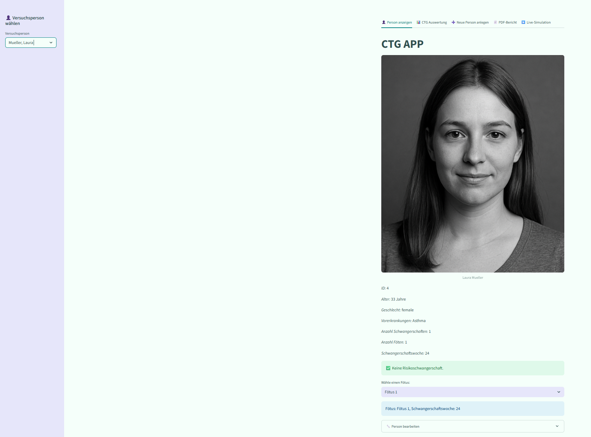

# 🩺 CTG APP – Analyse & Verwaltung von Schwangerschaftsdaten

Dies ist eine interaktive **Streamlit-Webanwendung**, mit der Schwangerschaftsdaten erfasst, visualisiert und ausgewertet werden können. Ein besonderes Augenmerk liegt dabei auf **CTG-Daten** (Kardiotokografie), die zur Überwachung der fötalen Herzfrequenz und Wehenaktivität verwendet werden.

---

## 🚀 Funktionen

### 👤 Versuchspersonen anzeigen
- Auswahl existierender Personen
- Anzeige von Profilbild, Alter, Geschlecht, Vorerkrankungen, Anzahl Föten und Schwangerschaftswoche
- Bearbeitungsformular zur Aktualisierung der Daten
- Erkennung von **Risikopatientinnen** (z. B. Mehrlingsschwangerschaft, Bluthochdruck, Alter > 35)

### 📊 CTG-Auswertung
- Anzeige von fötalen Herzfrequenzstatistiken (Durchschnitt, Minimum, Maximum)
- interaktives Liniendiagramm der Herzfrequenz und Wehenaktivität (Uterine Contractions) über Zeit
- Unterscheidung von mehreren Föten durch farbige Linien
- Wehenanalyse mit Kategorisierung
- Einstellbare Wehenstärke und -Abstände für individuell auf Patientinnen angepasste Kategorisierung (Einstellung bestimmen welche Peaks als Wehen erkannt werden)


### ➕ Neue Personen anlegen
- Erfassung neuer Patientendaten inkl. Profilbild, Vorerkrankungen und Geburtsdatum (ab 1950)
- Upload von CTG-Daten (mehrere CSV-Dateien möglich)
- Automatische Speicherung der Daten in einer JSON-Datenbank

### 📄 PDF-Bericht generieren
- Auswahl der Inhalte (Basisdaten, Risikoeinschätzung, CTG-Daten, Wehenanalyse etc.)
- Eingrenzung des CTG-Zeitraums möglich
- Download als PDF-Datei mit eingebettetem Bild und Diagramm

### ▶️ Live-Simulation
- Herzfrequenz-Daten eines Fötus in Echtzeit simulieren mit konfigurierbarem Alarm (Herzfrequenzgrenze)
- Auswahl eines Fötus
- Auswahl eines Simulationstempos (Standard Einstellung ist 0.1s/Schritt für relativ flüssige Darstellung)
-  Standard Alarm Einstellung bei 110bpm (klinisch relevanter Wert) für Testung wird jedoch empfohlen 145bpm einzustellen 
- Dient als Vorschau für mögliche Live-Anschlüsse eines CTG-Geräts

---

## 🗂️ Projektstruktur
```
Abschlussprojekt_programmieruebungII/
│
├── main.py # Haupt-Skript mit Streamlit-Interface
├── Person.py # Personen- & Fötus-Klassen
├── read_CSV.py # CTG-Daten-Klasse mit Visualisierung & Statistik
├── report_generator.py # PDF-Erzeugung mit fpdf
├── wehen_analysis.py # Logik zur Wehenanalyse
├── ctg_simulator.py # Live-Simulation der CTG-Werte
│
├── data/
│ ├── person_db.json # JSON-Datenbank mit Versuchspersonen
│ ├── pictures/ # Profilbilder als PNG
│ └── CTG_data/ # Hochgeladene CTG-CSV-Dateien
│
└── ...
```

---

## 💾 Beispiel-CSV

```csv
time,LB,UC
1,140,20
2,138,19
...
```

> Mehrlingsdaten wie `LB1`, `LB2` werden ebenfalls unterstützt.

---

## 🛠️ Installation

### 1. 📥 Projekt klonen

```bash
git clone <https://github.com/mak2494/Abschlussprojekt_programmieruebungII.git>
cd Abschlussprojekt_programmieruebungII
```

### 2. 🧱 Abhängigkeiten installieren

Die App nutzt [pdm](https://pdm.fming.dev/latest/) zur Paketverwaltung:

```bash
pdm install
```

> Alternativ kann auch `pip install -r requirements.txt` verwendet werden (nicht empfohlen, wenn `pdm.lock` existiert).

### 3. 🚀 Anwendung starten

```bash
streamlit run main.py
```

Die Anwendung startet dann im Standardbrowser und ist einsatzbereit.

---

## 📦 Abhängigkeiten (Auszug)

- `streamlit`
- `fpdf`
- `pandas`
- `numpy`
- `plotly`
- `kaleido`
- `scipy`
- `nbformat`

---

## 📌 Hinweise

- Die App ist **nicht für den klinischen Einsatz geeignet**, sondern dient ausschließlich zu **Lern- und Analysezwecken**.
- **Google Chrome** wird als bevorzugter Browser empfohlen.
- CTG-CSV-Dateien müssen mindestens die Spalten `time`, `LB`, `UC` enthalten.

---

## 📸 Vorschau



---

## 👩‍💻 Projektinfos

- Modul: **Programmierübungen 2** – Management Center Innsbruck  
- Studierende: **Marie Köhl** & **Hannah Kleutgens**  
- Semester: **Sommersemester 2025**